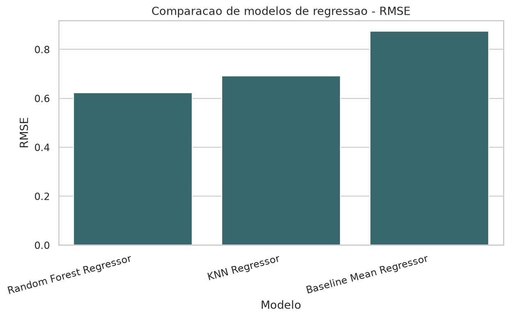
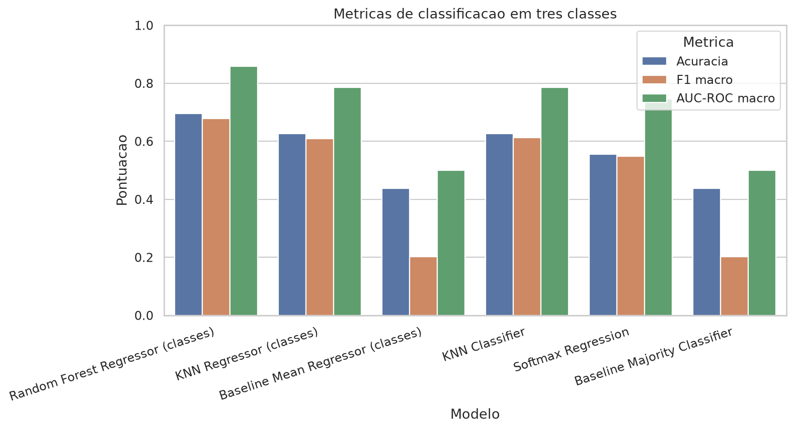

# Wine Quality - Machine Learning do Zero

Este projeto compara modelos de aprendizado de máquina no dataset Wine Quality,
de Cortez et al. (2009), usando os arquivos de vinho tinto e vinho branco da UCI.

O projeto implementa os modelos manualmente, sem depender de bibliotecas que
já entregam estimadores prontos. O script usa `numpy` para álgebra linear e cálculos vetorizados,
`pandas` para leitura/manipulação dos dados e `matplotlib`/`seaborn` para os
gráficos.

## Objetivo

O problema foi modelado de duas formas:

- **Regressão:** prever diretamente a nota `quality`.
- **Classificação em três classes:** prever se o vinho é `ruim`, `mediano` ou
  `bom`.

A divisão das classes é:

| Classe | Regra |
|---|---:|
| Ruim | `quality <= 5` |
| Mediano | `quality == 6` |
| Bom | `quality >= 7` |

Os regressores também são avaliados como classificadores ao converter a nota
contínua prevista para essas três faixas. Para predições contínuas, os cortes
usados são `5.5` e `6.5`, equivalentes a arredondar a nota prevista antes de
classificar.

## Modelos Escolhidos

Foram escolhidos três modelos que fazem sentido para este problema e para a
restrição de implementação manual:

1. **Random Forest**
   - Modelo não linear mais forte para prever a nota de qualidade.
   - Implementado com árvores CART manuais, amostragem bootstrap e média das árvores.
   - Usa subconjuntos aleatórios de features em cada divisão, como em Random Forest.
   - Profundidade, mínimo por divisão/folha e `max_features` são escolhidos por
     uma busca pequena com validação cruzada.

2. **Softmax Regression**
   - Classificador direto para as três classes.
   - Implementado com gradiente descendente, softmax estável e regularização L2.
   - Usa pesos balanceados por classe para reduzir o efeito do desbalanceamento.

3. **K-Nearest Neighbors (KNN)**
   - Modelo não linear simples, baseado em distância.
   - Implementado para regressão e classificação.
   - O valor de `k` é escolhido por validação cruzada manual.

Nenhum desses modelos é importado de `scikit-learn` ou biblioteca equivalente.

## Pipeline

O arquivo principal é [`wine_quality.py`](wine_quality.py). Ele executa:

1. Leitura de `winequality-red.csv` e `winequality-white.csv`.
2. Criação da feature `is_red`.
3. Análise exploratória dos dados.
4. Checagem de valores ausentes e relatório de linhas duplicadas.
5. Divisão treino/teste estratificada em 80/20 por `quality × is_red`.
6. Padronização manual das features usando apenas o treino.
7. Validação cruzada manual para hiperparâmetros, com padronização refeita
   dentro de cada dobra.
8. Treinamento dos modelos escolhidos.
9. Cálculo manual das métricas.
10. Repetição dos modelos finais em cinco splits para média e IC95.
11. Geração de imagens e tabelas finais de resultados.

## Métricas

Para regressão:

- RMSE
- MAE
- R2

Para classificação:

- Accuracy
- F1 macro
- AUC-ROC macro one-vs-rest
- Precision/Recall por classe
- Matriz de confusão

## Resultados da Execução Atual

Resumo gerado por `python wine_quality.py`:

| Modelo | Formulação | RMSE | Accuracy | F1 macro | AUC-ROC macro |
|---|---:|---:|---:|---:|---:|
| Random Forest Regressor | regressão + 3 classes | 0.6235 | 0.6949 | 0.6781 | 0.8582 |
| KNN Regressor | regressão + 3 classes | 0.6912 | 0.6257 | 0.6093 | 0.7863 |
| KNN Classifier | classificação 3 classes | - | 0.6264 | 0.6128 | 0.7862 |
| Softmax Regression | classificação 3 classes | - | 0.5550 | 0.5489 | 0.7453 |

Na execução validada, a Random Forest manual melhorou a melhor regressão do
pipeline:

- Melhor RMSE entre regressores: **Random Forest Regressor**, com `0.6235`.
- Melhor AUC-ROC macro entre regressores convertidos para classe:
  **Random Forest Regressor**, com `0.8582`.
- Melhor AUC-ROC macro entre classificadores diretos: **KNN Classifier**, com `0.7862`.

Em cinco divisões treino/teste repetidas, a Random Forest manteve RMSE médio de
`0.6225 ± 0.0023` e AUC-ROC macro média de `0.8561 ± 0.0060`.

A checagem antes da divisão treino/teste encontrou `1177` linhas repetidas,
agrupadas em `992` padrões duplicados. Elas são relatadas no log e mantidas para
preservar os arquivos originais da UCI.

A tabela completa fica salva em [`results_summary.csv`](results_summary.csv).
Os resultados por split ficam em [`repeated_split_results.csv`](repeated_split_results.csv)
e o resumo com IC95 em [`repeated_split_summary.csv`](repeated_split_summary.csv).

## Gráficos Gerados

Os gráficos novos ficam em [`images/`](images):

- `quality_distribution.png`
- `class_distribution_three_classes.png`
- `correlation_heatmap.png`
- `confusion_matrix_random_forest_regressor_class_binned.png`
- `confusion_matrix_knn_regressor_class_binned.png`
- `confusion_matrix_softmax_regression.png`
- `confusion_matrix_knn_classifier.png`
- `model_comparison_regression_rmse.png`
- `model_comparison_classification_metrics.png`
- `rf_feature_importance_regressor.png`
- `softmax_coefficients.png`

Exemplos:





## Estrutura

```text
.
├── wine_quality.py
├── requirements.txt
├── results_summary.csv
├── repeated_split_results.csv
├── repeated_split_summary.csv
├── winequality-red.csv
├── winequality-white.csv
├── winequality.names
└── images/
```


## Como Executar

Crie e ative um ambiente virtual:

```bash
python -m venv .venv
.venv/bin/python -m pip install -r requirements.txt
```

Execute o pipeline:

```bash
.venv/bin/python wine_quality.py
```

Ao final, o script imprime a tabela consolidada no terminal, salva os gráficos
em `images/` e atualiza `results_summary.csv`.

